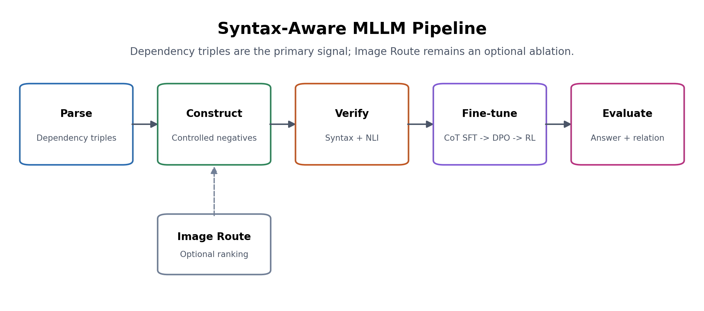
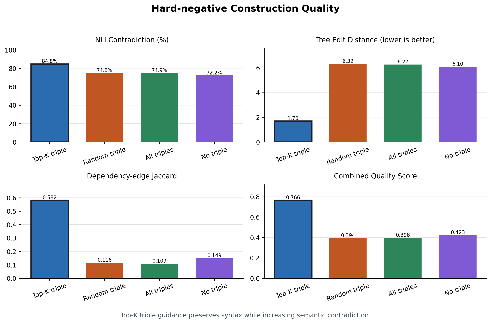
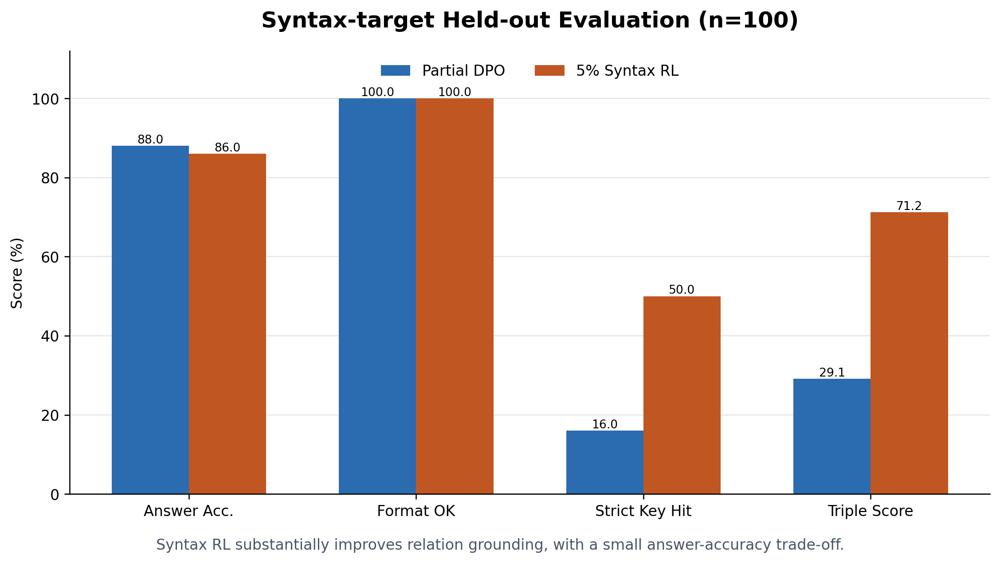

# Syntax-Aware MLLM

面向多模态大语言模型的句法敏感数据构造、训练与评测框架。项目关注一类容易被通用benchmark弱化的问题：两个caption整体语义和句法高度相似，但主客体、属性绑定、空间关系或谓词关系存在关键差异。



## 核心工作

1. 构造语义相反、但句法结构与原描述高度相似的困难负文本和专用测试集。
2. 以依存句法三元组为主要监督，依次进行 CoT SFT、syntax-first DPO 和 syntax-first RL。

Image Route保留为可选目标排序与消融模块。主训练流程不依赖其质量，RL默认`route_sample_weight_coef=0`。

## 实验概览



Top-K三元组约束在约1万条MSCOCO样本上获得84.8%的NLI contradiction比例、0.582的依存边Jaccard和0.766的综合质量分数，整体优于随机三元组、全部三元组和无三元组构造。



在100条syntax-target held-out样本上，5% syntax-first RL将严格关键关系命中率从部分训练DPO的16%提高到50%，三元组得分从0.291提高到0.712；答案准确率从88%变为86%。该结果说明关系表达明显增强，同时也暴露了答案保持仍需继续平衡的问题。

> 当前结果属于阶段性验证：训练数据主要来自MSCOCO约1万条样本，DPO未覆盖全部计划样本，RL使用5%训练子集，held-out结果基于100条样本。

## 目录

```text
syntax_visual_router/
  syntax/       依存解析与关系表示
  data/         负文本、CoT、偏好及RL数据构造
  training/     CoT SFT、DPO、syntax-first RL
  evaluation/   held-out评测及公共文本指标
  image_route/  可选Image Route研究模块
scripts/        一行式Windows运行入口
docs/           方法、贡献、代码地图和复现说明
results/        结构化实验结果
assets/figures/ README与文档使用的可复现图表
tests/          轻量单元测试
```

## 快速开始

```powershell
conda activate vlm
pip install -e .
python -m spacy download en_core_web_lg
```

准备包含 `image_path`、`caption` 字段的 `data/captions.jsonl` 后，按顺序运行：

```powershell
scripts\01_build_dataset.cmd
scripts\02_train.cmd
scripts\03_evaluate.cmd
```

模型和数据路径均可通过命令行覆盖；环境变量示例见 `configs/paths.example.env`。详细流程见 [复现指南](docs/REPRODUCIBILITY.md)。

重新生成结果图：

```powershell
pip install -e ".[visualization]"
python scripts\plot_results.py
```

## 文档

- [项目总览](PROJECT_OVERVIEW.md)
- [贡献与边界](docs/CONTRIBUTIONS.md)
- [方法设计](docs/METHOD.md)
- [代码地图](docs/CODE_MAP.md)
- [实验结果与限制](docs/RESULTS.md)
- [实验问题与解决记录](docs/ENGINEERING_NOTES.md)
- [复现指南](docs/REPRODUCIBILITY.md)
- [重构说明](docs/CLEANUP_REPORT.md)

本仓库不包含模型权重、大型数据集、API凭据或本机路径。
